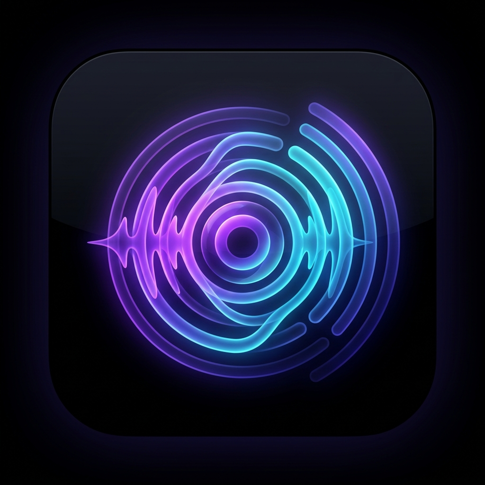

# Radio Over 📻

<p align="center">
  
</p>

<p align="center">
  <strong>A minimalist, privacy-focused internet radio + podcast player with audio clipping and live transcripts.</strong>
</p>

<p align="center">
  <a href="https://github.com/thisscribe000/radio_over/releases"></a>
  <a href="https://flutter.dev"></a>
  <a href="LICENSE"></a>
  <a href="https://f-droid.org"></a>
</p>

---

## ✨ Features

- 🌍 **Worldwide Live Radio**: Stream thousands of stations globally powered by the community-driven [Radio Browser](https://www.radio-browser.info/) API with real-time ICY metadata and resilient auto-reconnect.
- 🎙️ **Podcast 2.0 Directory & Feeds**: Search and subscribe to shows through [Podcast Index](https://podcastindex.org/) and custom RSS feeds with automatic background feed refresh.
- 📝 **Live Transcripts & Synchronized Highlighting**: Follow along with WebVTT and SRT transcripts featuring real-time phrase highlighting and interactive chapter jumping.
- ✂️ **Dual-Anchor Audio Snippet Trimmer**: Clip and capture memorable audio moments with precision sliders, nudge buttons (-10s/-1s/+1s/+10s), duration presets (15s–3m), and audio waveform visualization.
- 💬 **Community Highlights Feed**: Share audio quotes, discover highlights from other listeners, participate in threaded discussions, and see verified creator badges.
- 🎚️ **Audio Equalizer & Voice Clarity**: 4 acoustic sound profiles (*Vocal Clarity*, *Balanced*, *Bass Boost*, *Treble Boost*) plus voice enhancement and auto-volume leveling.
- 📥 **Offline Downloads**: Save complete podcast episodes to local storage for offline playback.
- 🌙 **Sleep Timer**: Flexible timer with duration presets (15, 30, 45, 60 minutes) or graceful *End of Episode* stop.
- 🔒 **100% Privacy & Zero Analytics**: No tracking, no telemetry, and no ads. Free and open source forever.

---

## 🛠️ Architecture & Tech Stack

- **Framework**: [Flutter](https://flutter.dev/) (SDK `3.41.4`)
- **Audio Engine**: [`just_audio`](https://pub.dev/packages/just_audio) + [`audio_service`](https://pub.dev/packages/audio_service) for native background audio and OS lock-screen media controls
- **Audio Session**: [`audio_session`](https://pub.dev/packages/audio_session)
- **Local Persistence**: Abstract Store pattern with [`shared_preferences`](https://pub.dev/packages/shared_preferences) for offline playback state, favorites, and history
- **Tests**: 299 comprehensive unit and widget tests (`flutter test`)

---

## 🚀 Getting Started

### Prerequisites
- [Flutter SDK](https://docs.flutter.dev/get-started/install) (`>= 3.41.4`)
- Android SDK 21+ / JDK 17

### Installation
```bash
# Clone the repository
git clone https://github.com/thisscribe000/radio_over.git
cd radio_over

# Install dependencies
flutter pub get

# Run tests
flutter test

# Run app in debug mode
flutter run
```

### Build Release APK
```bash
flutter build apk --release
```
The resulting APK will be generated at `build/app/outputs/flutter-apk/app-release.apk`.

---

## 📦 F-Droid Compliance & Distribution

Radio Over is fully configured for F-Droid automated builds:
- **Pinned Flutter SDK**: Version `3.41.4` specified in CI for dynamic extraction.
- **AGP 8+ Compatibility**: Built-in `configureNamespace` fallback script in `android/build.gradle.kts`.
- **Fastlane Metadata**: Stored in `fastlane/metadata/android/en-US/`.
- **F-Droid Build Recipe**: Located at `fdroid/com.radioover.radio_over.yml`.
- See [`FDROID_FLUTTER_PLAYBOOK.md`](FDROID_FLUTTER_PLAYBOOK.md) for full compliance documentation.

---

## 📄 License

This project is licensed under the **MIT License** - see the [LICENSE](LICENSE) file for details.
